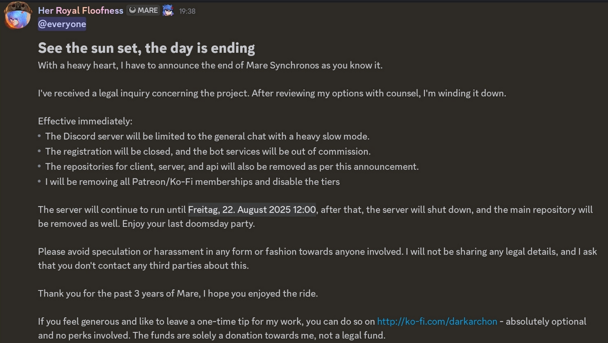

import Callout from "@/components/Callout.astro";

---
<Callout type="info">
  This blog is likely going to explain in way more detail than a lot of the FFXIV community cares for.
    I am sharing this blog with people unfamiliar with Mare Synchronos, Dalamud, or even FFXIV.
    I'm trying to accomodate for a wide audience, so sorry if I over-explain a little! 
    Also this isn't complete yet, I'm live writing all of this as I learn how Astro works. Sorry!
</Callout>

## Optional Details for People Outside of FFXIV
<details close class="animate group rounded-lg border border-black/15 dark:border-white/20 px-5 py-1.5">
    <summary
        class="cursor-pointer rounded-t-lg px-5 py-1.5 font-medium transition-colors group-open:bg-black/5 hover:bg-black/5 dark:group-open:bg-white/5 hover:dark:bg-white/5"
    >Click for details</summary>
    <p>
        The Final Fantasy XIV community is blessed with a large group of people dedicated to enhancing the game outside
        the bounds of what's available out of the box. XIVLauncher (link) comes bundled with Dalamud, a system that hooks
        into game functions on-the-fly to read, act on, enhance, and even completely replace elements and functionality
        entirely. Simple things like calculating critical hit percent chance from your Crit stat to display on your
        character sheet all the way to outright fully automated gameplay.

        The Dalamud team has a list of prepackaged and reviewed sets of these plugins that meet specific criteria, like
        not sending invalid data to the servers or performing detectable automation. Outside of this realm is where
        Mare Synchronos comes in.

        Custom Repo Plugins don't fall under the review purview of the Dalamud team, so people are free to develop plugins
        however they like to do whatever they want. A subsection of these plugins revolve around modding, or doing
        things like texture and model replacements, enhancing the functionality of the /gpose (screenshot tools) functions,
        etc.. Penumbra/Glamourer, the two cornerstone plugins that handle on-the-fly texture and model editting/swaps, are
        probably the most used plugins in the ecosystem _period_... people just want their catgirls to look pretty.

        However, modding plugins (and most other plugins) by their nature are client side only - if it's not sending any data
        to the server then no one else but you can see them. [YoshiP, the Director and Producer of the game, wrote a
        blog post](https://na.finalfantasyxiv.com/lodestone/topics/detail/9e5517bca992ff35133f519db15eb456d2183251)
        that is very useful to help understand why the company might have issues with mods/plugins in general, but
        more specifically anything that goes beyond just client side changes.
        
        This is where Mare Synchronos comes in.

        MareSync hooked into Penumbra/Glamourer in order to transmit the appearance data of your modded character, transfer the
        files through a management server hosted by the developer, and send them to another person to be rendered live. This
        massively changed the modding ecosystem of FFXIV forever and what was joking "a niche of a niche plugin" became hundreds
        of thousands of users over its three-year lifespan. At one point near the end of its lifespan it had transferred
        Petabytes (PLURAL) of data a month. How Cloudflare didn't freak out about it we'll never know...

        Due to some back and forth with the developer I was tagged as a 'wannabe dev' in their Discord server, which gave me
        access to see behind the curtain a little. I was already hyper-connected to a lot of info streams but it opened my eyes
        to a lot about the community as a whole - for better and most definitely for worse. Darkarchon is pretty damn
        knowledgeable and he held together a lot of the community whether they realized it or not.
    </p>
</details>
## Day 0
The day this post went out was a big shocker for the community as a whole.


Those of us marked as wannabe devs in the MareSync Discord had some advance knowledge on it, as the process of verifying/consulting with legal
was done ahead of any public posts (not that it stopped someone leaking it from a closed dev chat in the Dalamud
discord). I'll probably do an aside about some of the really weird and honestly alarming things I saw come out of
the community and Internet at large as a result of this announcement. It was very eye-opening.

Needless to say the situation sucked for the XIV community at-large. People had gotten used to a level of comfort with
these plugins that was always unsustainable. It's all built on hopes and dreams that Square Enix wouldn't flip the
entirety of Dalamud on its head one day. They still could, to be clear, and even as I type this I see posts about 
projects doubling down on the very things the director and producer YoshiP took issue with about these plugins. (link)

In the wake of the shutdown people scrambled to try to replace the functionality. Whole communities were built up around
syncing mods for coordinated events (venues, roleplaying, 'nightclubs' or whatever you want to call them). Thus the
sync wars had begun...

## Day 7
It didn't take long for replacements to prop up and tribalism to begin, but I didn't really care to try to integrate
myself into any of them. I noticed my wife and her Free Company didn't, either, and it got me thinking...

What if I built a private version of the plugin? Darkarchon had made the source code available with some simple
instructions on how to do it, so why couldn't I follow them? Surely it's not that hard, right? (The original source
code is no longer available but many backups were floating around, including other sync services building on top of it)

Spoiler: it was more difficult than even the devs I followed to a new group like a leech implied it was. For me, at
least. I'm not a programmer by any means, but I know how to read and apply code, interpret what I'm seeing and follow
along due to my background in scripting and general domain administration. So with a lot of help from a few of them
and a ton of research along the way I set out to make my own private instance for my wife and her friends.

## Lets get technical
Mare Synchronos is built in .NET upon the existing framework provided by Dalamud. Right out of the box as long as the
plugin had a server to respond back to queries the plugin itself would work without issue once loaded into XIV.

(Note for later: probably link to or write up a blog about wtf Dalamud et al. even is from my PoV as an unskilled
programmer and wannabe developer)
<Callout type="warning">
    For obvious reasons I am not including screenshots of any of this working in game but I will post code snippets as
    relevant.
</Callout>
So the more complicated part for me was going to be building the server side of things. Thankfully darkarchon left
some useful instructions on setting up the services utilizing [Docker](https://www.docker.com/). Unfortunately they were 
woefully out of date and also meant that I had to finally learn how Docker even worked. I've used Linux in server
environments for work (I learned a lot screwing up QRadar installs on bare metal) and for running random game servers
over the years but nothing for sustained, 'public' access that had very niche support paths. 

Thanks to two very lovely people whom I will not name for now I did a lot of fumbling through setting up docker and
nginx as a reverse proxy just to get services up and running.

### Screwup One: Trying to Make Cloudflare Work
So Darkarchon utilized Cloudflare in order to better protect his service from regular DDoSing and try to improve overall
access. While it was just a small part of the latter, the former is where it really came in handy due to 
[their consistent ability to block them](https://www.pcgamer.com/hardware/cloudflare-mitigates-yet-another-record-breaking-ddos-attack-which-at-22-2-tbps-is-nearly-twice-as-big-as-the-last-hyper-volumetric-attack/).
If it worked for him, it should work for me, right?

Well maybe if I hadn't already screwed up configuring nginx's configuration at this stage it would have worked, but I
also had to accept that integrating Cloudflare into my setup was likely overkill considering my use case. Speaking of
which...

### What is my use case?
As of now, the most amount of people who have connected to my private instance is about 11 people all at once, and that's
with growth from the FC completely unrelated to me entirely. The people using it don't (generally) want to sync to large
syncshells full of hundreds of people are attend big parties. If they want to do that there are other sync plugins that
can provide for them, so for our purposes it just needs to work with this FC and be smooth enough to not be troublesome.
Actually very manageable.

### Screwup Two: Docker Compose Files
This is a two-parter screw up: not really knowing how docker compose files worked and working off of older documentation on
a system I didn't understand. Here's a slice from the docker readme:

```md
Furthermore there are two environment variables `DEV_MARE_CDNURL` and `DEV_MARE_DISCORDTOKEN` which you are required to set.  
`DEV_MARE_CDNURL` should point to `http://<yourip or dyndns>:6200/cache/` and `DEV_MARE_DISCORDTOKEN` is an oauth token from a bot you need to create through the Discord bot portal.
You should also set `DEV_MARE_CDNURL2` to `http://<yourip or dyndns>:6201/cache/`
It is enough to set them as User variables. The compose files refer to those environment variables to overwrite configuration settings for the Server and Services to set those respective values.  
It is also possible to set those values in the configuration.json files themselves.  
Without a valid Discord bot you will not be able to register accounts without fumbling around in the PostgreSQL database.

## 3. Run Mare Server
The run folder contains two major Mare configurations which is `standalone` and `sharded`.  
Both configurations default to port `6000` for the main server connection and `6200` for the files downloads. Sharded configuration additionally uses `6201` for downloads. No HTTPS.  
All `appsettings.json` configurations provided are extensive at the point of writing, note the differences between the shard configurations and the main servers respectively.  
They can be used as examples if you want to spin up your own servers otherwise.
```
In retrospect there are some elements that aren't obvious to someone not versed in the ecosystem or development in
general, but I'm a special kind of dumb. Here's a small list of my first missteps:
- Didn't even know how to set up an .env file or use them, so I just hardcoded everything
- Editing the wrong fields in the jsons that used generic service URLs that were meant to remain as-is
- Filling in one field that was only modified if you were using the sharded version of the service (I was not)
- Blindly swapping out names for the sake of branding without knowing what it might impact
- Relying on Gemini to try to pick out some of the error messages I was getting (turns out if it doesn't have full access
to context then neither will you!)

But that's just the start. I hadn't messed with nginx before so I also needed to learn how it, and reverse proxies,
actually worked and what would be a secure setup that allowed the plugin to talk to the server. One thing I did pick up
quickly on was setting up the Docker compose file to not expose every service port to the Internet blindly. Yes, I know
everyone and their mother can easily find out what the configuration is just by referencing the same codebase as I was
but better to prevent inquiries than invite them openly.

### Screwup Three: Nginx Configuration
With a lot of help from another fellow wannabe dev I managed to get a working config, but not without some growing pains.
This screwup was pretty brief because a lot of my tinkering with nginx had nothing to do with Nginx itself, but the fact
I was troubleshooting multiple aspects at the same time with not a lot of understanding of how it was fitting together
meant I was adjusting things I didn't need to. The lesson here was to explicitly not do this, but that's obvious in
hindsight, isn't it?

One of the big hangups was getting the Discord OAuth to work properly. Rather than manage secret keys with the service 
after registering, Discord OAuth made it painless for people on the original service to reauthenticate and move on with
their lives. If I wasn't trying to troubleshoot nginx, the plugin, and oauth at the same time I would have had it working
way faster than the like two weeks it took me to get around to it.